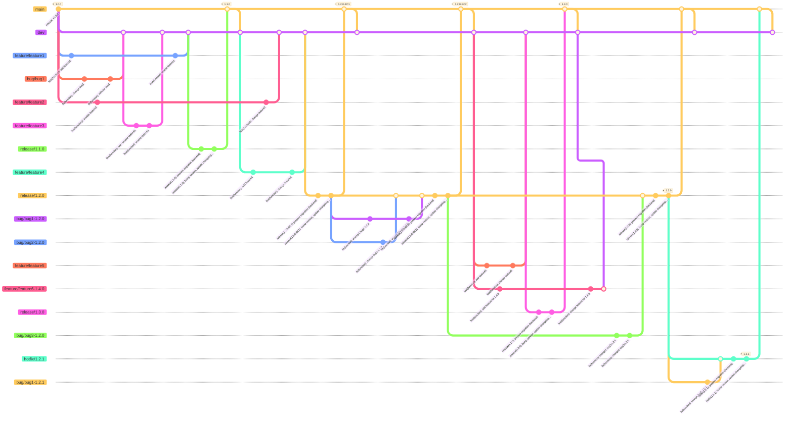

# Development / Deployment (CI/CD)

## Git diagram

```mermaid
%%{init: { 'logLevel': 'debug', 'theme': 'base' } }%%
gitGraph
    commit id: "release: v1.0.0" tag:"1.0.0"
    branch dev order: 1
    checkout dev
    branch feature/feature1 order: 2
    commit id:"feat(function): add feature1"
    checkout dev
    branch bug/bug1  order: 3
    commit id: "fix(function): change bug1"
    checkout dev
    branch feature/feature2  order: 4
    commit id:"feat(function)!: enable feature2"
    checkout bug/bug1
    commit id:"fix(function): refactor bug1"
    checkout dev
    merge bug/bug1
    checkout dev
    branch feature/feature3 order: 5
    commit id:"feat(function): wip - enable feature3"
    checkout dev
    checkout feature/feature3
    commit id: "feat(function): enable feature3"
    checkout dev
    merge feature/feature3
    checkout feature/feature1
    commit id:"feat(function): enable feature1"
    checkout dev
    merge feature/feature1
    branch release/1.1.0 order: 6
    commit id: "release(1.1.0): prepare migration (backend)"
    commit id: "release(1.1.0): bump version, update changelog..."
    checkout main
    merge release/1.1.0 tag: "1.1.0"
    checkout dev
    merge main
    checkout dev
    branch feature/feature4  order: 7
    commit id: "feat(function): add feature4"
    checkout feature/feature2
    commit id: "feat(function)!: change feature2"
    checkout dev
    merge feature/feature2
    checkout feature/feature4
    commit id: "feat(function): change feature4"
    checkout dev
    merge feature/feature4
    branch release/1.2.0 order: 8
    commit id: "release(1.2.0-RC1): prepare migration (backend)"
    commit id: "release(1.2.0-RC1): bump version, update changelog..."
    checkout main
    merge release/1.2.0 tag: "1.2.0-RC1"
    checkout dev
    merge main
    checkout release/1.2.0
    branch bug/bug1-1.2.0 order: 9
    commit id:"fix(function): change1 bug1-1.2.0"
    checkout release/1.2.0
    branch bug/bug2-1.2.0 order: 10
    commit id:"fix(function): change bug2-1.2.0"
    checkout release/1.2.0
    merge bug/bug2-1.2.0
    checkout bug/bug1-1.2.0
    commit id:"fix(function): change2 bug1-1.2.0"
    checkout release/1.2.0
    merge bug/bug1-1.2.0
    commit id: "release(1.2.0-RC2): prepare migration (backend)"
    commit id: "release(1.2.0-RC2): bump version, update changelog..."
    checkout main
    merge release/1.2.0 tag: "1.2.0-RC2"
    checkout dev
    merge main
    branch feature/feature5 order: 11
    commit id: "feat(function): add feature5"
    checkout dev
    branch feature/feature6-1.4.0 order: 12
    commit id: "feat(function): add feature for 1.4.0"
    checkout feature/feature5
    commit id: "feat(function): change feature5"
    checkout dev
    merge feature/feature5
    branch release/1.3.0 order: 13
    commit id: "release(1.3.0): prepare migration (backend)"
    commit id: "release(1.3.0): bump version, update changelog..."
    checkout main
    merge release/1.3.0 tag: "1.3.0"
    checkout dev
    merge main
    checkout feature/feature6-1.4.0
    commit id: "feat(function): change feature for 1.4.0"
    merge dev
    checkout release/1.2.0
    branch bug/bug3-1.2.0 order: 14
    commit id:"fix(function): change1 bug3-1.2.0"
    commit id:"fix(function): change2 bug3-1.2.0"
    checkout release/1.2.0
    merge bug/bug3-1.2.0
    commit id: "release(1.2.0): prepare migration (backend)"
    commit id: "release(1.2.0): bump version, update changelog..." tag: "1.2.0"
    checkout main
    merge release/1.2.0
    checkout dev
    merge main
    checkout release/1.2.0
    branch hotfix/1.2.1 order: 15
    branch bug/bug1-1.2.1 order: 16
    commit id:"fix(function): change bug1-1.2.1"
    checkout hotfix/1.2.1
    merge bug/bug1-1.2.1
    commit id: "hotfix(1.2.1): prepare migration (backend)"
    commit id: "hotfix(1.2.1): bump version, update changelog..." tag: "1.2.1"
    checkout main
    merge hotfix/1.2.1
    checkout dev
    merge main
```

## Development flow with Deployment (CI/CD)

